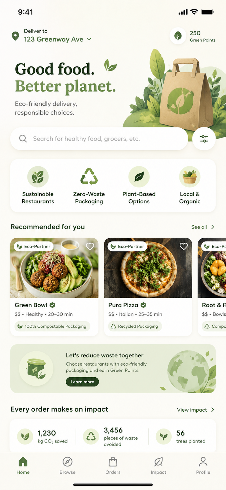

# GreenLoop · Earthbound Sustainable Delivery

<p align="center">
  
</p>

<p align="center">
  <b>A native mobile door-dash style delivery app focused on sustainability, returnable packaging economics, and Duolingo-inspired social CO2 gamification.</b>
</p>

<p align="center">
  <a href="https://tinyurl.com/Hacaithon" target="_blank"></a>
  
  
</p>

---

## 🍃 Core Product Concept

**GreenLoop (Earthbound Delivery)** transforms food and grocery delivery by integrating sustainability into every interaction. Download the app and instantly feel the environmental focus through a warm, organic design language, intuitive DoorDash-familiar UX, and tangible rewards for circular packaging choices.

### Key Features & Innovations

1. **Returnable Packaging & Direct Discounts:**
   - Users select reusable containers during meal customization to unlock discounted pricing (e.g. $1.50 off per meal).
   - Packaging returns earn **Green Points** and store coupons.

2. **Smart Drop-Off Logistics Network:**
   - Flexible 3-way container return ecosystem:
     - 🎓 **Campus Smart Hubs:** Drop off at dedicated smart collection bins across university campuses.
     - 🏪 **In-Store Return:** Return packaging directly to participating restaurants.
     - 🛵 **Next Delivery Pick-up:** Hand back returnable containers to your delivery rider on your next order.

3. **Duolingo-Style Social CO2 Competition:**
   - Dynamic leaderboard quantifying $kg\text{ CO}_2$ prevented from entering the atmosphere.
   - Compete against friends, maintain eco-streaks (🔥), earn badges, and celebrate sustainability milestones.

4. **Merchant Sustainability Goal Boost (>30% Criteria):**
   - Participating merchants who achieve >30% sustainable packaging sales earn official **"Eco-Partner"** marketing badges.
   - High-performing sustainable merchants receive algorithm search boosts and top placement in the feed.

---

## 📁 Repository Directory Structure

```
.
├── README.md                           # Master project guide & HaCAiThon 2026 official bases
├── ROADMAP.md                          # Production implementation roadmap & milestone checklist
├── DESIGN.md                           # Earthbound Delivery Design System tokens & guidelines
├── ARCHITECTURE.md                     # Technical architecture & layout guide for Claude Code / AI Agents
├── LICENSE                             # MIT Open-Source License
├── stitch_greenloop_sustainable_delivery.zip # Original compressed Stitch template export
│
├── docs/                               # Developer & AI Agent Context Documentation
│   ├── FILE_INDEX.md                   # Directory map & complete file descriptions
│   ├── SCREENS_OVERVIEW.md             # Breakdown of the 4 prototype UI screens & user flows
│   └── DESIGN_SYSTEM_GUIDE.md          # Guide on consuming DESIGN.md color tokens & Tailwind config
│
└── templates/                          # Untouched Google Stitch HTML/Tailwind Prototype Screens
    ├── index.html                      # Interactive Navigation Hub to preview screens in browser
    ├── home_sustainable_feed/          # Screen 1: Home Feed & Search
    │   ├── code.html                   # HTML / Tailwind template (Untouched)
    │   └── screen.png                  # UI Screenshot reference
    ├── restaurant_green_bowl/          # Screen 2: Sustainable Merchant Detail (Green Bowl)
    │   ├── code.html                   # HTML / Tailwind template (Untouched)
    │   └── screen.png                  # UI Screenshot reference
    ├── rewards_returns/                # Screen 3: Smart Drop-off & Packaging Return Hub
    │   ├── code.html                   # HTML / Tailwind template (Untouched)
    │   └── screen.png                  # UI Screenshot reference
    ├── impact_leaderboard/             # Screen 4: Duolingo-Style Social CO2 Leaderboard
    │   ├── code.html                   # HTML / Tailwind template (Untouched)
    │   └── screen.png                  # UI Screenshot reference
    └── global_overview/                # Global Design Overview
        └── overview.png                # Combined screen preview image
```

---

## 🚀 Quickstart & Screen Navigator

To preview the live Google Stitch interactive prototype screens in your browser:

```bash
# Option A: Start a simple Python web server
python3 -m http.server 8000

# Option B: Use Node npx serve
npx serve .
```

Open **`http://localhost:8000/templates/index.html`** to launch the interactive prototype viewer.

---

## 🤖 Guide for AI Coding Agents (Claude Code / AGY)

- **Source Code Protection:** Do **NOT** edit the template files in `templates/*/code.html` directly. They are preserved as golden design references.
- **System Specs:** Read [`ARCHITECTURE.md`](file:///home/nicoquinta/code/equipo-4-haCAIthon-2026/ARCHITECTURE.md) for data schemas, component tree, and architectural rules.
- **Design Tokens:** Refer to [`DESIGN.md`](file:///home/nicoquinta/code/equipo-4-haCAIthon-2026/DESIGN.md) and [`docs/DESIGN_SYSTEM_GUIDE.md`](file:///home/nicoquinta/code/equipo-4-haCAIthon-2026/docs/DESIGN_SYSTEM_GUIDE.md) when building new UI components.
- **File Lookup:** Consult [`docs/FILE_INDEX.md`](file:///home/nicoquinta/code/equipo-4-haCAIthon-2026/docs/FILE_INDEX.md) to locate any file in the workspace.

---

## 🏆 HaCAiThon 2026 · Resumen de Bases Oficiales

### Centro de Alumnos de Ingeniería UC · Primera Edición

#### 1. Qué Es
Hackathon presencial de 8 horas (12:00 a 20:00 hrs) para estudiantes de Ingeniería, LICC y LICD, trabajando en equipos multidisciplinarios en soluciones a seis desafíos sociales usando programación e IA.

#### 2. Requisitos y Equipos
- Equipos de 4 personas. Máximo 1 estudiante de posgrado por equipo (los otros 3 de pregrado).
- Todo el código debe ser escrito durante el evento (12:40 a 17:10 hrs). Se autoriza y recomienda el uso de asistentes de IA (Claude Code, Gemini, Copilot).

#### 3. Fecha, Lugar e Itinerario
- **Fecha:** Viernes 14 de agosto, 12:00 a 20:00 hrs.
- **Lugar:** Campus San Joaquín, Sala de Estudio, Primer Piso.
- **Itinerario:**
  - `12:00` - Registro y acreditación.
  - `12:15` - Bienvenida y reglas.
  - `12:40` - Bloque de desarrollo.
  - `17:10` - Feria de proyectos y votación.
  - `18:50` - Deliberación del jurado.
  - `19:00` - Premiación y cierre.

#### 4. Entregables y Licencia
- Repositorio público en GitHub con todo el proyecto.
- Licencia Open Source OSI (MIT) con archivo `LICENSE` en la raíz.

#### 5. Criterios de Evaluación
- Innovación y Creatividad (15%)
- Impacto y Relevancia Social (25%)
- Viabilidad Técnica (25%)
- Ejecución y Funcionamiento (20%)
- Comunicación (15%)

---

## 📄 License

This project is licensed under the [MIT License](file:///home/nicoquinta/code/equipo-4-haCAIthon-2026/LICENSE).
